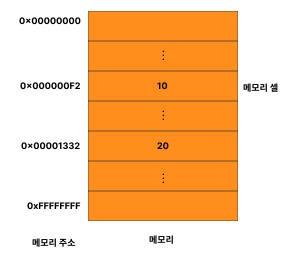

# 변수

## 변수란?

**변수는 하나의 값을 저장하기 위해 확보한 메모리 공간 자체 또는 그 메모리 공간을 식별하기 위해 붙인 이름을 말한다.**

> 변수는 프로그래밍 언어에서 값을 저장하고 참조하는 메커니즘으로, **값의 위치를 가리키는 상징적인 이름**이다.

<br></br>

다음과 같은 자바스크립트 코드를 실행한다고 해보자.

```js
10 + 20;
```

자바스크립트 엔진은 자바스크립트를 해석하고 실행한다. 이때 자바스크립트 엔진이 위 자바스크립트 코드를 계산(평가)하려면 먼저 `10`, `20`, `+`라는 기호(리터럴과 연산자)의 의미를 알고 있어야 하며, `10 + 20`이라는 식(표현식)의 의미도 해석(파싱)할 수 있어야 한다.

자바스크립트 엔진이 `10 + 20`이라는 식의 의미를 해석하면 `+` 연산을 수행하기 위해 먼저 `+` 연산자의 좌변과 우변의 숫자 값, 즉 피연산자를 기억한다. 컴퓨터는 연산과 기억을 수행하는 부품이 나눠져 있다. CPU를 사용해 연산하고, 메모리를 사용해 데이터를 기억한다.



> 메모리

각 셀은 고유의 메모리 주소를 갖는다. 이 메모리 주소는 메모리 공간의 위치를 나타내며, 0부터 시작해 메모리의 크기만큼 정수로 표현된다.

컴퓨터는 모든 데이터를 2진수로 처리한다. 따라서 메모리에 저장되는 데이터는 데이터의 종류와 상관없이 모두 2진수로 저장된다.


> 메모리에 기억된 데이터와 CPU의 연산

성공적으로 연산이 끝났고 연산 결과도 메모리에 저장되었지만 문제가 있다. CPU가 연산해서 만들어낸 숫자 값 30을 재사용할 수 없다는 것이다.

10 + 20이라는 연산을 했다는 것은 그 연산 결과가 필요하고 이를 단 한번만 사용한다면 문제가 없겠지만 만약 연산 결과 30을 재사용하고 싶다면 메모리 주소를 통해 연산 결과 30이 저장된 메모리 공간에 직접 접근하는 것 외에는 방법이 없다.

하지만 메모리 주소를 통해 값에 직접 접근하는 것은 치명적 오류를 발생시킬 가능성이 높은 매우 위험한 일이다. 만약 실수로 운영체제가 사용하고 있는 값을 변경하면 시스템을 멈추게 하는 치명적인 오류가 발생할 수도 있다 따라서 자바스크립트는 개발자의 직접적인 메모리 제어를 허용하지 않는다.

만약 자바스크립트가 개발자의 직접적인 메모리 제어를 허용하더라도 문제가 있다. 값이 저장될 메모리 주소는 코드가 실행될 때 메모리의 상황에 따라 임의로 결정된다. 따라서 동일한 컴퓨터에서 동일한 코드를 실행해도 코드가 실행될 때마다 값이 저장될 메모리 주소는 변경된다. 이처럼 코드가 실행되기 이전에는 값이 저장된 메모리 주소를 알 수 없으며, 알 수도 없다. 따라서 메모리 주소를 통해 값에 직접 접근하려는 시도는 올바른 방법이 아니다.

프로그래밍 언어는 기억하고 싶은 값을 메모리에 저장하고, 저장된 값을 읽어 들어 재사용하기 위해 변수라는 메커니즘을 제공한다.

**변수는 하나의 값을 저장하기 위해 확보한 메모리 공간 자체 또는 그 메모리 공간을 식별하기 위해 붙인 이름을 말한다.**

> 변수는 프로그래밍 언어에서 값을 저장하고 참조하는 메커니즘으로, **값의 위치를 가리키는 상징적인 이름**이다.

상징적 이름인 변수는 프로그래밍 언어의 컴파일러 또는 인터프리터에 의해 값이 저장된 메모리 공간의 주소로 치환되어 실행된다. 따라서 개발자가 직접 메모리 주소를 통해 값을 저장하고 참조할 필요가 없고 변수를 통해 안전하게 값에 접근할 수 있다.

앞서 살펴본 코드를 변수를 사용해 다시 작성해보자.

```js
var result = 10 + 20;
```

10 + 20은 연산을 통해 새로운 값 30을 생성한다. 그리고 연산을 통해 생성된 값 30은 메모리 공간에 저장된다. 이때 메모리 공간에 저장된 값 30을 다시 읽어 들여 재사용할 수 있도록 값이 저장된 메모리 공간에 상징적인 이름을 붙인 것이 바로 변수다.


> 값의 생성과 변수에의 할당

메모리 공간에 저장된 값을 식별할 수 있는 고유한 이름(위 예제에서는 `result`)을 **변수 이름**(또는 변수명)이라 한다. 그리고 변수에 저장된 값(위 예제에서는 30)을 **변수 값**이라고 한다.

변수에 값을 저장하는 것을 **할당**(**대입, 저장**)이라 하고, 변수에 저장된 값을 읽어 들이는 것을 **참조**라 한다.

<br></br>

## 식별자

변수 이름을 식별자라고도 한다. **식별자는 어떤 값을 구별해서 식별할 수 있는 고유한 이름을 말한다.**

값은 메모리 공간에 저장되어 있다. 따라서 식별자는 메모리 공간에 저장되어 있는 어떤 값을 구별해서 식별해낼 수 있어야 한다. 이를 위해 식별자는 어떤 값이 저장되어 있는 메모리 주소를 기억(저장)해야 한다.

위에서 식별자 `result`는 값 30을 식별할 수 있었다. 이를 위해 식별자 `result`는 값 30이 저장되어 있는 메모리 주소 `0x0669F913`을 기억해야 한다. 즉, 식별자는 값이 저장되어 있는 메모리 주소와 매핑 관계를 맺으며, 이 매핑 정보도 메모리에 저장되어야 한다.

이처럼 **식별자는 값이 아니라 메모리 주소를 기억하고 있다.** 식별자로 값을 구별해서 식별한다는 것은 식별자가 기억하고 있는 메모리 주소를 통해 메모리 공간에 저장된 값에 접근할 수 있다는 의미다. 즉, 식별자는 메모리 주소에 붙인 이름이라고 할 수 있다.

식별자라는 용어는 변수 이름에만 국한해서 사용하지 않는다. 예를 들어, 변수, 함수, 클래스 등의 이름은 모두 식별자다. 식별자인 변수 이름으로는 메모리 상에 존재하는 변수 값을 식별할 수 있고, 함수 이름으로는 메모리 상에 존재하는 함수(자바스크립트에서 함수는 값이다)를 식별할 수 있다. 즉, 메모리 상에 존재하는 어떤 값을 식별할 수 있는 이름은 모두 식별자라고 부른다.

변수, 함수, 클래스 등의 이름과 같은 식별자는 네이밍 규칙을 준수해야 하며, **선언**에 의해 자바스크립트 엔진에 식별자의 존재를 알린다.

<br></br>

## 변수 선언

변수 선언이란 변수를 생성하는 것을 말한다. 좀 더 자세히 말하면 값을 저장하기 위한 메모리 공간을 확보하고 변수 이름과 확보된 메모리 공간의 주소를 연결해서 값을 저장할 수 있게 준비하는 것이다. 변수 선언에 의해 확보된 메모리 공간은 확보가 해제되기 전까지는 누구도 확보된 메모리 공간을 사용할 수 없도록 보호되므로 안전하게 사용할 수 있다.

**변수를 사용하려면 반드시 선언이 필요하다. 변수를 선언할 때는 `var`, `let`, `const` 키워드를 사용한다.**

다음 코드를 살펴보자. `var` 키워드는 뒤에 오는 변수 이름을 새로운 변수를 선언할 것을 지시하는 키워드다.

```js
var score; // 변수 선언(변수 선언문)
```

위 변수 선언문은 다음과 같이 변수 이름을 등록하고 값을 저장할 메모리 공간을 확보한다.


> 변수 선언

변수를 선언한 이후, 아직 변수에 값을 할당하지 않았다. 따라서 변수 선언에 의해 확보된 메모리 공간은 비어 있을 것으로 예상할 수 있으나 확보된 메모리 공간에는 자바스크립트 엔진에 의해 `undefined`라는 값이 암묵적으로 할당되어 초기화된다.

자바스크립트 엔진은 변수 선언을 다음과 같은 2단계에 거쳐 수행한다.

1. **선언 단계**: 변수 이름을 등록해서 자바스크립트 엔진에 변수의 존재를 알린다.

2. **초기화 단계**: 값을 저장하기 위한 메모리 공간을 확보하고 암묵적으로 `undefined`를 할당해 초기화한다.

> 💡 변수 이름은 어디에 등록되는가?
>
> 변수 이름을 비롯한 모든 식별자는 실행 컨텍스트에 등록된다. 실행 컨텍스트는 자바스크립트 엔진이 소스코드를 평가하기 위해 필요한 환경을 제공하고 코드의 실행 결과를 관리하는 영역이다. 자바스크립트 엔진은 실행 컨텍스트를 통해 식별자와 스코프를 관리한다.

`var` 키워드를 사용한 변수 선언은 선언 단계와 초기화 단계가 동시에 진행된다. `var score;`는 선언 단계를 통해 변수 이름 `score`를 등록하고, 초기화 단계를 통해 `score` 변수에 암묵적으로 `undefined`를 할당해 초기화한다.

일반적으로 초기화란 변수가 선언된 이후 최초로 값을 할당하는 것을 말한다. `var` 키워드로 선언한 변수는 `undefined`로 암묵적인 초기화가 자동 수행된다. 따라서 `var` 키워드로 선언한 변수는 어떠한 값도 할당하지 않아도 `undefined`라는 값을 갖는다.

만약 초기화 단계를 거치지 않으면 확보된 메모리 공간에는 이전에 다른 애플리케이션이 사용했던 값이 남아있을 수 있다. 이러한 값을 쓰레기 값이라 한다. 따라서 메모리 공간을 확보한 다음, 값을 할당하지 않은 상태에서 곧바로 변수 값을 참조하면 쓰레기 값이 나올 수 있다. 자바스크립트의 `var` 키워드는 암묵적으로 초기화를 수행하므로 이러한 위험으로부터 안전하다.

변수를 사용하려면 반드시 선언이 필요하다. 변수뿐만 아니라 모든 식별자(함수, 클래스 등)가 그렇다. 만약 선언하지 않은 식별자에 접근하면 `ReferenceError`(참조 에러)가 발생한다. `ReferenceError`는 식별자를 통해 값을 참조하려 했지만 자바스크립트 엔진이 등록된 식별자를 찾을 수 없을 때 발생하는 에러다.

<br></br>

## 변수 선언의 실행 시점과 변수 호이스팅

다음 예제를 살펴보자.

```js
console.log(score); // undefined

var score; // 변수 선언문
```

변수 선언문보다 변수를 참조하는 코드가 앞에 있다. 자바스크립트 코드는 인터프리터에 의해 한 줄씩 순차적으로 실행되므로 `console.log(score);`가 가장 먼저 실행되고 순차적으로 다음 줄에 있는 코드를 실행한다. 따라서 `console.log(score);`가 실행되는 시점에는 아직 `score` 변수의 선언이 실행되지 않았으므로 참조 에러가 발생할 것처럼 보인다. 하지만 참조 에러가 발생하지 않고 `undefined`가 출력된다.

그 이유는 **변수 선언이 소스코드가 한 줄씩 순차적으로 실행되는 시점, 즉 런타임(코드의 평가 단계)이 아니라 그 이전 단계에서 먼저 실행되기 때문이다.**

자바스크립트 엔진은 소스코드를 한 줄씩 순차적으로 실행하기에 앞서 먼저 소스코드의 평가 과정을 거치면서 소스코드를 실행하기 위한 준비를 한다. 이때 소스코드 실행을 위한 준비 단계인 소스코드의 평가 과정에서 자바스크립트 엔진은 변수 선언을 포함한 모든 선언문(변수 선언문, 함수 선언문 등)을 소스코드에서 찾아내 먼저 실행한다. 그리고 소스코드의 평가 과정이 끝나면 비로소 변수 선언을 포함한 모든 선언문을 제외하고 소스코드를 한 줄씩 순차적으로 실행한다.

즉, 자바스크립트 엔진은 변수 선언이 소스코드의 어디에 있든 상관없이 다른 코드보다 먼저 실행한다. 따라서 변수 선언이 소스코드의 어디에 위치하는지와 상관없이 어디서든지 변수를 참조할 수 있다.

위 예제는 변수 선언(선언 단계와 초기화 단계)이 소스코드가 순차적으로 실행되는 런타임 이전 단계에서 먼저 실행된다는 증거다. 이처럼 **변수 선언문이 코드의 선두로 끌어 올려진 것처럼 동작하는 자바스크립트 고유의 특징을 변수 호이스팅**이라 한다.

사실 변수 선언뿐 아니라 `var`, `let`, `const`, `function`, `function*`, `class` 키워드를 사용해서 선언하는 모든 식별자(변수, 함수, 클래스 등)는 호이스팅된다. **모든 선언문은 런타임 이전 단계에서 먼저 실행되기 때문이다.**
